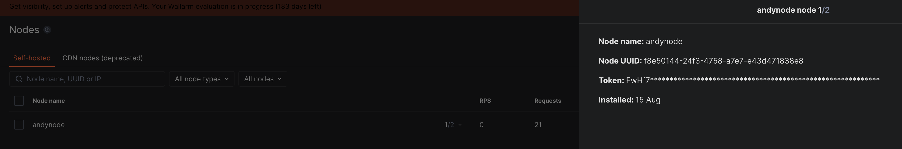
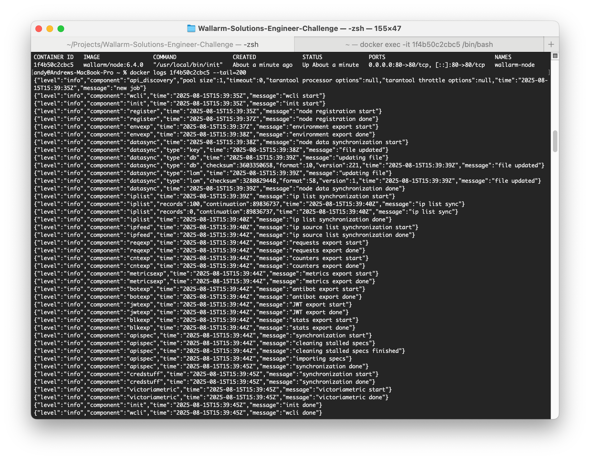
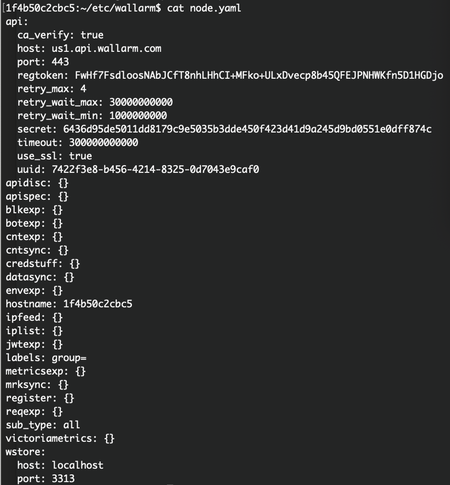
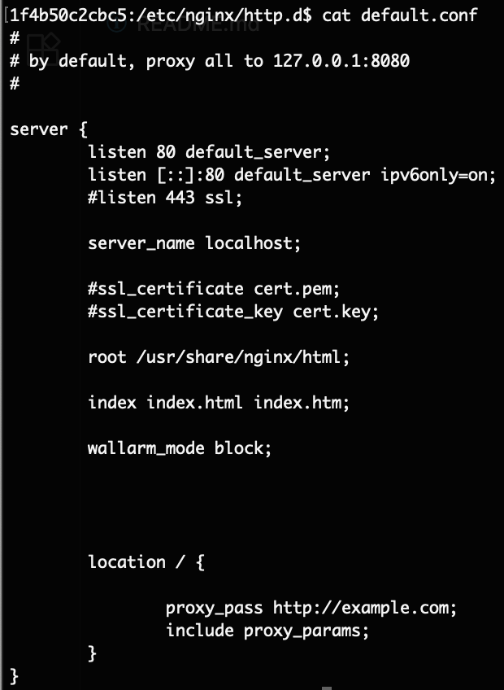
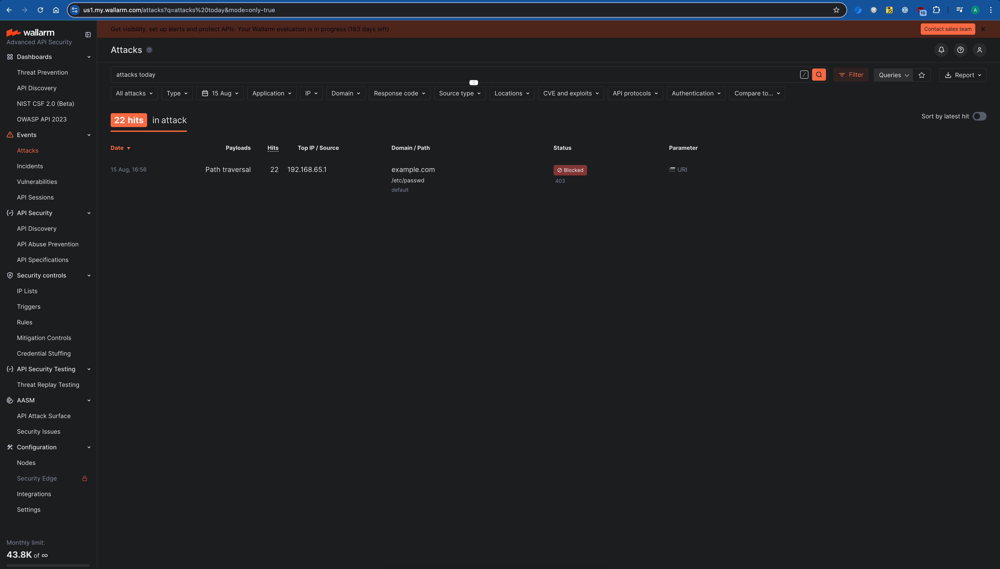
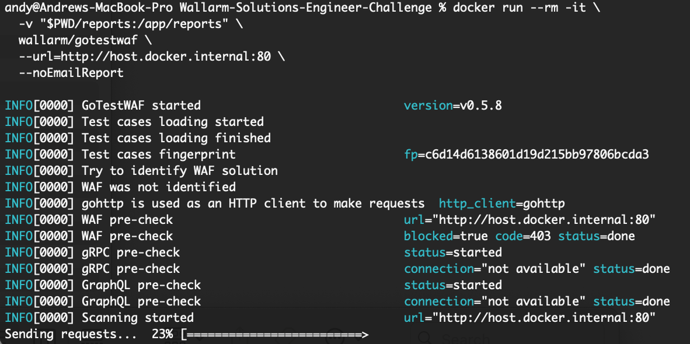
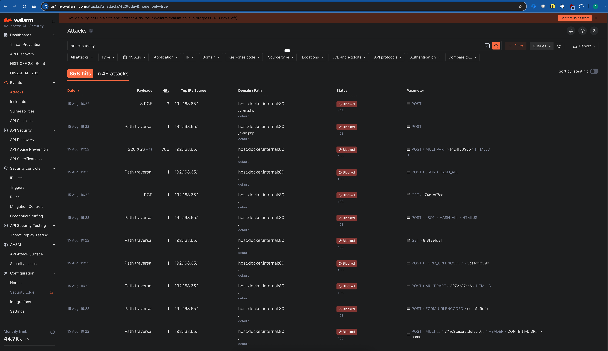
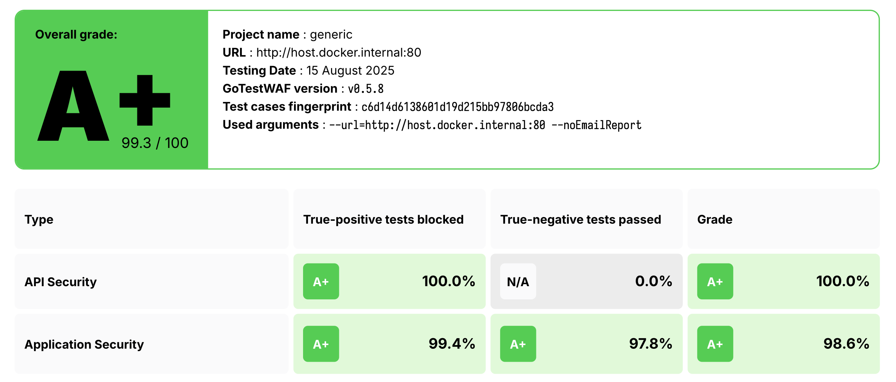
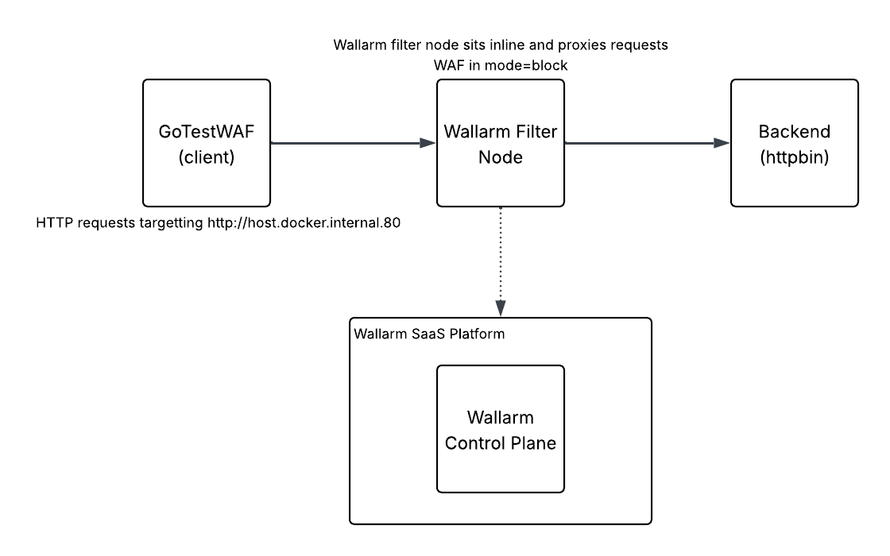

# Wallarm Solutions Engineer Technical Evaluation


# ⭐️Wallarm Deployment Notes⭐️

**Step 0: Access to the UI**  
I already had access to the Wallarm console (https://us1.my.wallarm.com/)

**Step 1: Decide on deployment method**    
I selected the option to use the Docker image to deploy locally on my machine. As I didn't have easy access to a cloud environment. I was using the following documentation link: https://docs.wallarm.com/installation/inline/compute-instances/docker/nginx-based/

**Step 2: Install Docker Destop**  
Due to a recent fresh install of MacOS, I needed to install Docker Desktop for mac first.
https://docs.docker.com/desktop/setup/install/mac-install/ - location of installation files.

**Step 3: Wallarm Token**  
I decided to run the container by passing environment variables, this was just personal preference.
I selected "Node token" and followed the instructions to create a node in the UI with the corresponding token.


  

**Step 4: Running the container**  
I ran docker using the following code, this included the token I had generated from the Wallarm console  
`docker run -d -e WALLARM_API_TOKEN='FwHf7FsdloosNAbJCfT8nhLHhCI+MFko+ULxDvecp8b45QFEJPNHWKfn5D1HGDjo' -e WALLARM_LABELS='group=' -e NGINX_BACKEND='example.com' -e WALLARM_API_HOST='us1.api.wallarm.com' -e WALLARM_MODE=block -p 80:80 wallarm/node:6.4.0` 

You'll notice I actually added the environment variable for blocking `WALLARM_MODE=block` directly here, this meant that the mode wasn't set to monitoring.

**Step 5: Checked the logs**  
I checked the logs using the following command `docker logs 1f4b50c2cbc5 --tail=200`. This showed that everything was working as expected, including registration and synchronisation.



**Step 6: Accessing the container**  
Access the container via the following command `docker exec -it 1f4b50c2cbc5 /bin/bash`

**Step 7: Checked the configuration to understand better**  
I checked both the `/opt/wallarm/etc/wallarm/node.yaml` file and the `/etc/nginx/http.d/default.conf` files just to understand better.  
In the node.yaml file I could see the token and also the UUID had been populated.  
In the default.conf file I could block mode was present.





**Step 8: Tested connectivity**  
To test the node operation, I sent the following command  
`curl -i http://localhost/etc/passwd -H "Host: example.com"`  
Anything send to localhost is port mapped to 80:80 as per the initial container run.

**Step 9: Confirmed within the UI**  
Logged into the Wallarm UI and confirmed the requests were hitting (and being blocked as I changed the mode) the Wallarm platform. See screenshot below. 




# Using GoTestWAF


Now the node is up and running - I setup a new backend (httpbin) and tested it with **GoTestWAF**.

**Step 1: Deployed new backend**  
Used the following command to pull the docker image for httpbin  
`docker pull ghcr.io/psf/httpbin:0.10.2` 

Also prepared for GoTestWAF with creating a reports folder `mkdir -p reports`

**Step 2: Configuring Wallarm to point to httpbin**  
With the initial setup, I figured Wallarm to use an upstream of example.com as shown in **Step 4: Running the container** section.

I removed the old container: `docker rm -f wallarm-node`  
Then deployed a fresh Wallarm node pointing to httpbin  

```docker run -d --name wallarm-node -e WALLARM_API_TOKEN='YOUR_TOKEN' -e WALLARM_LABELS='group=' -e NGINX_BACKEND='host.docker.internal:8081' -e WALLARM_API_HOST='us1.api.wallarm.com' -e WALLARM_MODE='block' -p 80:80 wallarm/node:6.4.0 ```

This setup the Wallarm node to correctly proxy to httpbin.

**Step 3: Ran GoTestWAF against Wallarm** 

`docker run --rm -it \`
  `-v "$PWD/reports:/app/reports" \`
  `wallarm/gotestwaf \`
  `--url=http://host.docker.internal:80 \`
  `--noEmailReport`




**Step 4: Output from the Wallarm console**  


**📊Step 5: GoTestWAF Reports, Results & Flow Diagram📊**  
The reports can be found here:

- [PDF Report](reports/waf-evaluation-report-2025-August-15-18-24-48.pdf)
- [CSV Report](reports/waf-evaluation-report-2025-August-15-18-24-48.csv)  


**🚀Overal results where excellent🚀**  
Here is a snapshot of the findings:


---
**Flow diagram showing the logical flow of traffic**  
